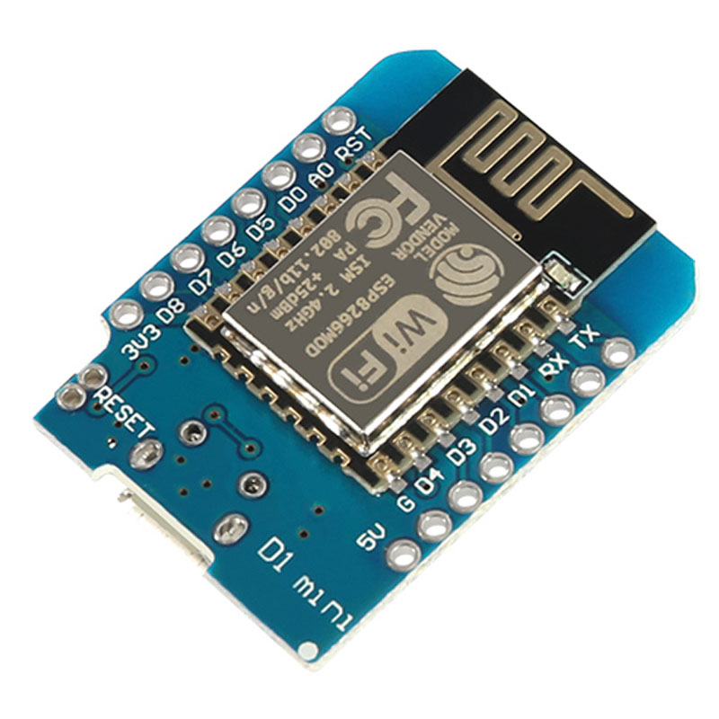
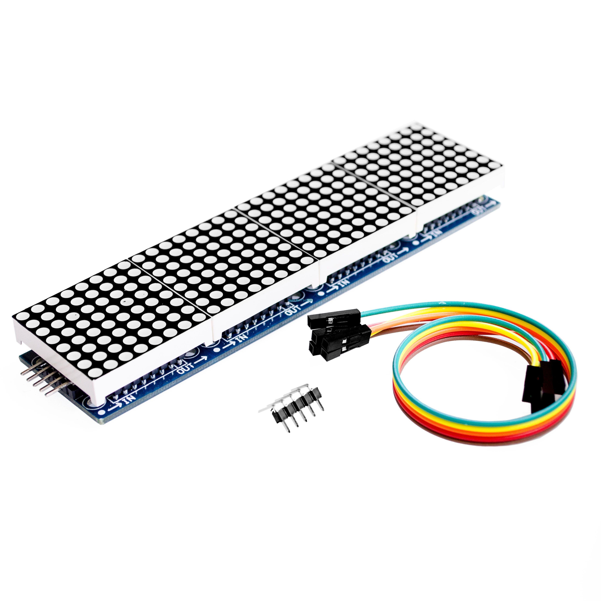

# arduino-youtube-clock

#### Youtube counter/clock ESP8266 + MAX7219

#### Arduino parts

ESP8266 ESP-12 ESP12 WeMos D1 Mini Module Wemos D1 Mini WiFi Development Board Micro USB 3.3V Based On ESP-8266EX 11
- https://a.aliexpress.com/_BSOaCh
- https://docs.wemos.cc/en/latest/d1/d1_mini.html

MAX7219 Dot Matrix Module For Arduino Microcontroller 4 In One Display with 5P Line Red/Yellow Green/Bule
- https://a.aliexpress.com/_B02xfP
- https://www.maximintegrated.com/en/products/power/display-power-control/MAX7219.html

---

